# 🎥 About the app
--------------------------------------------

<p align="center">
 
</p>

## 🎬 Welcome to the Civerse Movies & Series ! 🍿✨
Dive into a world of endless entertainment, where you can explore movies and TV shows from every category  action, drama, comedy, romance, sci-fi, and more! 🎭 From discovering your favorite actors 🎥 to exploring their full filmography 📚, we’ve got you covered. Build your own collections, follow categories you love ❤️, and enjoy a personalized cinematic journey like never before! 🌟

**Key Features:**
- 🔍 **Search** for any movie or series.
- 👤 **Actor Details** — learn about your favorite stars.
- ⭐ **Rate & Review** — give feedback on movies/series.
- 🎯 **MCQ Game** — get personalized recommendations.
- 📂 **Custom Collections** — create and manage your own watchlists.
- 🚫 **Content Filter** — blur inappropriate visuals.
- 🌓 **Dark & Light Theme** support.
- 🌐 **Multi-language** — English & Arabic.

## App Screens:

<table>
<tr>
  <td></td>
  <td></td>
  <td></td>
  <td></td>
</tr>
<tr>
  <td>Splash Screen</td>
  <td>Onboarding 1</td>
  <td>Onboarding 2</td>
  <td>Onboarding 3</td>
</tr>

<tr>
  <td></td>
  <td></td>
  <td></td>
  <td></td>
</tr>
<tr>
  <td>Login Screen</td>
  <td>Home Screen</td>
  <td>Home Screen</td>
  <td>Home Screen</td>
</tr>

<tr>
  <td></td>
  <td></td>
  <td></td>
  <td></td>
</tr>
<tr>
  <td>Explore Screen</td>
  <td>Search Explore Screen</td>
  <td>List Explore Screen</td>
  <td>History Explore</td>
</tr>

<tr>
  <td></td>
  <td></td>
  <td></td>
  <td></td>
</tr>
<tr>
  <td>Movie/ Series Details</td>
  <td>Cast Details</td>
  <td>Rate Movie/Series</td>
  <td>Top Review</td>
</tr>

<tr>
  <td></td>
  <td></td>
  <td></td>
  <td></td>
</tr>
<tr>
  <td>Profile Screen</td>
  <td>Edit profile</td>
  <td>Change language</td>
  <td>Content Preferences</td>
</tr>
</table>
# Modularization
<p align="center">
  
</p>

## 🏛️ Modularization Explained

This diagram illustrates a modern, multi-module architecture based on Clean Architecture principles. The arrows indicate the direction of dependency; for example, an arrow from **`:presentation`** to **`:domain`** means the **`:presentation`** module depends on the **`:domain`** module.

This setup ensures that core business logic is independent and that the UI and data layers can be modified or replaced without affecting the rest of the system.
This separation of concerns makes the codebase modular, testable, and easy to maintain.

Here's a breakdown of each module's role:

* **`:app`**
    * **Description**: The main application module that assembles the final app.
    * **Responsibilities**: It integrates all other modules (`:presentation`, `:data`, `:domain`, etc.), sets up the Firebase suite (Crashlytics, Analytics), and initializes the Hilt dependency graph for the application.

* **`:presentation`**
    * **Role:** The UI layer, containing Jetpack Compose screens, ViewModels, and navigation. It orchestrates user interactions and displays data.
    * **Dependencies:**
        * **`:domain`** (to access business logic/use cases).
        * **`:design_system`** (to use shared UI components).
        * **`:image_viewer`** (to display images with custom logic).

* **`:data`**
    * **Role:** Implements the repository interfaces defined in the domain layer. It handles all data operations, fetching from remote sources (Retrofit), local caches (Room) and **Jetpack DataStore** for storing user preferences. It is also responsible for securely loading API keys via `buildConfig`.
    * **Dependencies:** **`:domain`** (to implement its interfaces).

* **`:domain`**
    * **Role:** The core of the application. It contains the essential business logic, use cases, and data models. It is pure Kotlin and has no knowledge of the Android framework.
    * **Dependencies:** None. It is the most independent module in the project.

* **`:design_system`**
    * **Role:** A shared library of reusable UI components, Provides a consistent look and feel across the app by centralizing themes, colors, typography, and common Composables like buttons and text fields. It includes specialized components This ensures UI consistency across the app.
    * **Dependencies:** None.

* **`:image_viewer`**
    * **Role:** A **_specialized utility module_** responsible for loading images (using Coil) and handling content safety by classifying and blurring images using TensorFlow Lite.
    * **Dependencies:** None.
 
## 🛠️ Tech Stack & Key Libraries

CineVerse is built with a modern tools, libraries, robust, and scalable tech stack, leveraging the best of the Android ecosystem.

**Languages & Tools**
- Kotlin
- Android Studio
- Gradle
- Jetpack Components (ViewModel, LiveData, Navigation, etc.)

| Category | Technologies & Libraries |
| :--- | :--- |
| **Core & Architecture** | Kotlin, Coroutines & Flow, Clean Architecture, MVVM, Repository Pattern |
| **UI & Design** | Jetpack Compose, Material 3, Coil 3 (for image loading) |
| **Jetpack Suite** | Paging 3, WorkManager, DataStore, Navigation Component |
| **Dependency Injection**| Hilt |
| **Networking** | Retrofit, OkHttp, Kotlinx.Serialization |
| **Local Storage** | Room (for database caching)و DataStore (for key-value preferences) |
| **Machine Learning** | TensorFlow Lite (for on-device content classification) |
| **Firebase Suite** | Crashlytics, Performance Monitoring, Analytics |
| **Testing** | JUnit5, Mockk, Truth|
| **APIs** | The Movie Database (TMDb) API |

<br><br>
--------------
# 🚀 How to Setup & Run the Project Locally

Follow these steps to clone and run **CineVerse** on your local machine:

---

### 1️⃣ Clone the Repository
```bash
git clone https://github.com/Moscow-Squad/CineVerse.git
```
-------
### 2️⃣ Open the Project
Open Android Studio.

Click File > Open.

Select the cloned project folder.
-----
## 🔐 What to add (local secrets)

> These files are required to run Cineverse locally. **Do not commit them.**

| File | Where to place it | Purpose |
|------|-------------------|---------|
| `google-services.json` | `<project-root>/app/` | Firebase/Google services config for the app module |
| `service-account-key.json` | `<project-root>/` | CI / admin SDK tasks (e.g., Firebase App Distribution) |
| `keys.properties` | `<project-root>/` | API keys used by Gradle/BuildConfig |
----
### 5️⃣ Sync & Run
Sync Gradle.

Run the app on your local device or emulator.

-----------------------------------------------------------
# 🧩 App Architecture (Modules & Packages)

```mermaid
%%{init: {
  "flowchart": { "nodeSpacing": 50, "rankSpacing": 65 },
  "themeVariables": { "fontSize": "18px", "primaryColor": "#FDF6E3", "primaryTextColor": "#000", "primaryBorderColor": "#333", "lineColor": "#333" }
}}%%
flowchart TD
  A[CineVerse]

  %% app
  A --> APP
  subgraph APP[app]
    subgraph APPK[com.moscow.cineverse]
      APP1[main_activity/]
      APP2[CineVerseApp.kt]
      APP3[CineVerseRoot.kt]
    end
  end

  %% data
  A --> DATA
  subgraph DATA[data]
    subgraph DATAK[com.moscow.data_source]
      D1[di]
      D2[local]
      D3[mapper]
      D4[preference]
      D5[remote]
      D6[repository]
      D7[utils]
    end
  end

  %% design_system
  A --> DS
  subgraph DS[design_system]
    subgraph DSK[com.moscow.design_system]
      DS1[color]
      DS2[component]
      DS3[icon]
      DS4[radius]
      subgraph DST[theme]
        DST1[typography]
        DST2[utils]
      end
    end
  end

  %% domain
  A --> DOMAIN
  subgraph DOMAIN[domain]
    subgraph DOMK[com.moscow.domain]
      DOM1[exception]
      DOM2[mapper]
      DOM3[model]
      DOM4[repository]
      DOM5[usecase]
      DOM6[utils]
    end
  end

  %% image_viewer
  A --> IV
  subgraph IV[image_viewer]
    subgraph IVK[com.moscow.cineverse.image_viewer]
      IV1[classifier]
      IV2[component]
    end
  end

  %% presentation
  A --> PRES
  subgraph PRES[presentation]
    subgraph PRESK[com.moscow.cineverse]
      P1[base]
      P2[common_ui_state]
      P3[component]
      P4[mapper]
      P5[navigation]
      P6[paging]
      P7[screen]
      P8[utils]
    end
  end
```


-----------------------------------------------------------
# 👥 Contributers:
- [Farah Maytham](https://github.com/Farah-Dev4)
- [Adel Tamer](https://github.com/AdelTamer35)
- [Ahmed Hosny](https://github.com/Ahmed7osny1)
- [Mohamed Omer](https://github.com/MohamedOmar989)
- [Nour elhoda Ahmed](https://github.com/nourelhodaahmed)
- [Shrouk Mohamed](https://github.com/ShroukMohamed16)
- [Eslam Magdy](https://github.com/IslamMagd)
- [Hazem Alkateb](https://github.com/hazemka)
- [Israa Mohamed](https://github.com/israamohamed107)
- [Kareem](https://github.com/kareem-01)
- [Khaled Eid](https://github.com/khaledeid1k)
- [Zyad Abdullah](https://github.com/ZeyadAbdullah679)
<br><br>
